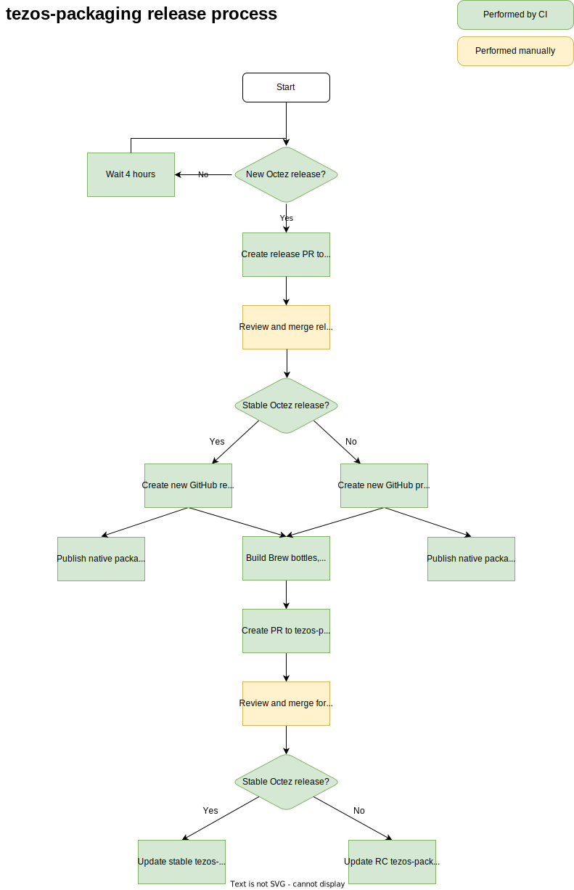

<!--
   - SPDX-FileCopyrightText: 2021 TQ Tezos <https://tqtezos.com/>
   -
   - SPDX-License-Identifier: LicenseRef-MIT-TQ
   -->
# Release workflow

This document explains the steps and timings of the release process in `tezos-packaging`.

The releasing process is almost fully automated, with the initial release PR being created
at most 4 hours after a new Octez release. The only steps that require manual intervention
are reviews of this initial PR and of the PR that updates macOS brew formulae.
This allows `tezos-packaging` to closely follow Octez releases without large waiting times.

This process can be described by the following diagram:
<!-- Use draw.io to edit this graph -->

